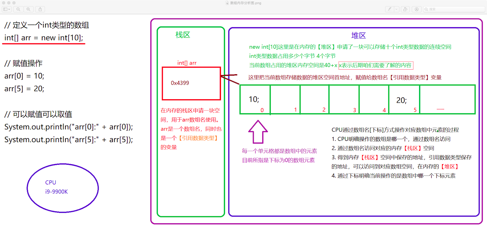
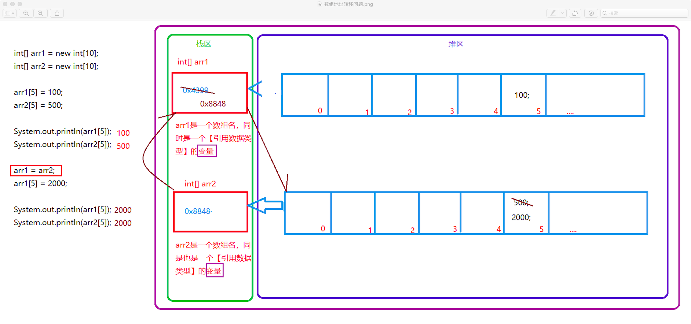

# 数组

## 1. 数组

### 1.1 生活中的数组

```
超时
	物品分门别类
	同类物品放在同一货架上
图书馆
	10本同名书
	1. 同一个书架上
	2. 连续存储
	3. 每本书有独立的编码
```

### 1.2 开发中的数据存储问题

```
问题
	1. 代码臃肿
	2. 代码阅读性差
	3. 数据维护性差
	4. 数据没有任何复用度，操作繁琐
参考图书馆存放图书方式使用数组
	1. 同样数据类型
	2. 存储连续，同一个空间
	3. 每一个数据有一个独一编码，有统一的名字
```

### 1.3 Java中的数组

```
数据类型[] 数组名 = new 数据类型[容量];

赋值左侧
	数据类型：
		告知编译器，当前数组能够保存的数据类型。并且确定后无法修改类型
	[]：
		1. 告知编译器这里定义是一个数组类型数据
		2. 明确告知编译器，数组名是【引用数据类型】
	数组名：
		1. 操作数组非常重要的数据
		2. 数组名是一个【引用数据类型】
赋值号右侧
	new：
		申请【XX】内存空间，并且清空整个内存空间中所有二进制位，所有的二进制
		位都是0
	数据类型：
		呼应前面
	[容量]：
		Capacity
		能存储几个元素
		【注意】
			一旦确定容量，针对于当前数组，后期容量无法修改
```

### 1.4 数组的下标【重点】

```
规定
	数组中的下标从零开始，到数组容量的容量 - 1
	超出有效下标范围，都是无效下标（后期考虑数组处理异常问题和负数使用问题）
操作中会出现的问题
	1. 数组下标异常
		ArrayIndexOutOfBoundException
```

### 1.5 数据内存分析图



### 1.6 数组和循环

```java
/*
获取数组容量的方式
	数组名.length 属性
	当前数组属性length是要占用一定空间的，属于数组的内容
*/
```

### 1.7 数组地址转移问题

```java
class Demo3 {
	public static void main(String[] args) {
		int[] arr1 = new int[10];
		int[] arr2 = new int[10];

		arr1[5] = 100;
		arr2[5] = 500;
		
		System.out.println(arr1[5]);
		System.out.println(arr2[5]);
		
		arr1 = arr2;
		arr1[5] = 2000;
		
		System.out.println(arr1[5]);
		System.out.println(arr2[5]);
	}
}
```



### 1.8 数组和方法之间的关系

```java
/*
	Java中如何数组成为方法的参数，以及使用方式
*/
	public static void main(String[] args){}
/*	
	格式：
		public static returnType methodName(arrayType[] arrayName)
*/
```

## 2. 数组算法

> 所有数组全部是int类型

### 2.1 完成数组逆序过程

```java
/*
静态数组
	int[] array = {1, 3, 5, 7, 9, 2, 4, 6, 8, 10};
	=> {10, 8, 6, 4, 2, 9, 7 ,5, 3, 1};
*/
```

### 2.2 找出数组最大值所在的下标位置

```java
/*
需求
	从int类型数组中找出最大值对应的下标位置
*/
```

### 2.3 找出数组中指定元素所在下标位置

```java
/*
需求
	从int类型数组中找出指定元素所在的下标位置
*/
```

### 2.4 获取数组中指定下标对应的元素

```java
/*
需求
	从int类型数组中找出指定下标对应的元素
*/
```

