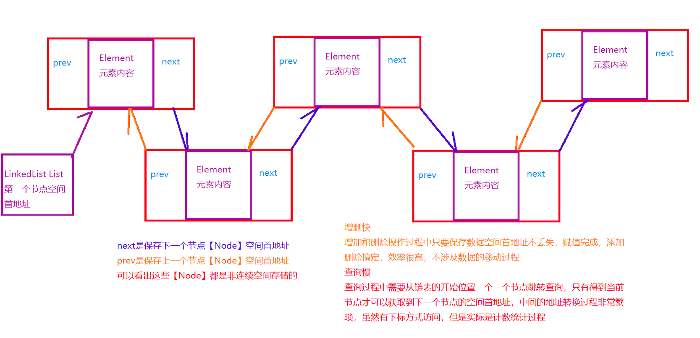

# Day15

## 1. ArrayList性能问题

##### 1.1 增删慢

```
增加慢
	1. 增加元素有可能出现调用grow方法，grow需要进行数组的扩容操作，操作过程中需要大
	量的移动和拷贝过程，浪费时间
	2. 在某一个指定位置添加元素，会导致从指定位置开始，之后的元素整体向后移动，涉及
	移动复制操作，浪费时间。

删除慢:
	1. 按照ArrayList可变长数组要求，删除元素之后，之后的内容都需要整体向前移动。
```

##### 1.2 查询快

##### 【补充知识点 内存】

```
内存中的地址
      1. 内存中的最小单元 字节
      2. 计算机为了记录标记每一个字节的内存，给内存进行了编号
      3. 航海中路60号，精确查询，唯一性
      4. 计算机内存按照字节，一个字节对应一个地址，从0开始编号 到 34359738367 (32G
      内存)
      5. 计算机通过内存编号访问对应的内存，效率是非常高的！！！
      6. 按照十进制表示地址编号，效果很差。 这里引入16进制 0x0 ~ 0x7 FFFF FFFF
      
null到底是谁?
     null ==> 0x0 内存中编号为0的地址
     该地址受到系统保护，任何程序读取，写入0x0地址，系统直接杀死程序
     一般用于在开发中初始化引用数据类型的变量，利用null报错。NullPointerException
```

## 2. LinkedList

### 2.1 LinkedList特征

```
底层是一个双向链表

链表结构
	1. 增删快
	2. 查询很慢很慢
```



### 2.2 LinkedList常用方法

```
LinkedList使用的方法大部分都是实现的List接口的方法
但是有一些特征方法
	addFirst(E e)
	addLast(E e)
	
	E getFirst()
	E getLast()
	
	removeFirst()
	removeLast()
	
以上方法组合，可以完成堆栈队列操作
	堆
		先进后出
		addLast(E e); E getLast(); removeLast();
	队列
		先进先出
		addLast(E e); E getFirst(); removeFirst();
```

