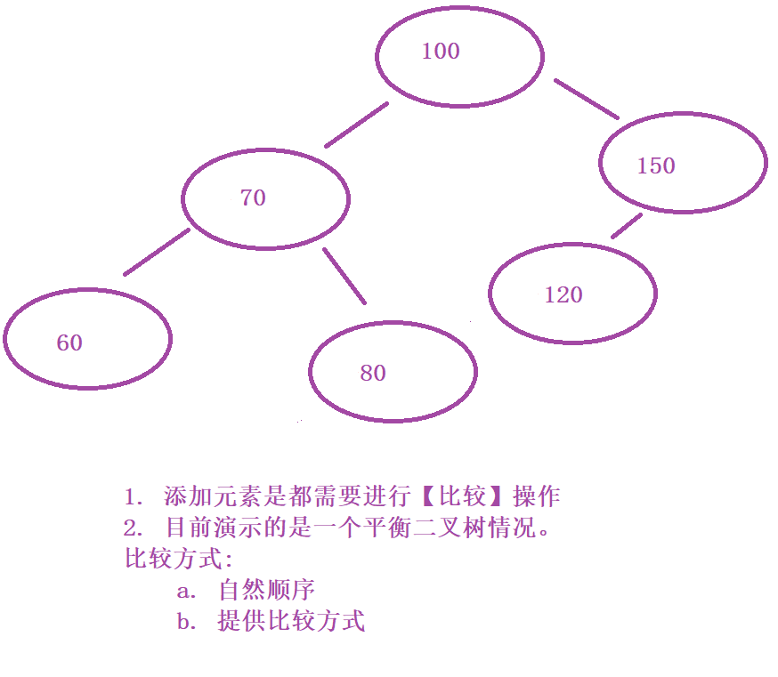

# Day 16

## 1. LinkedList

### 1.1 LinkedList实现

### 1.2 LinkedList特征

```
1. 存储数据，非连续空间
2. 数组之间通过引用连接，方便遍历和适用
3. 遍历效率低，数据非连续空间存储，需要通过引用跳转过程来完成
4. 删除插入操作效率高，但是注意地址的转移和保存问题
5. LinkedList链表当中的操作其实大部分都是和C语言指针一个概念
```

## 2. Object

### 2.1 Object类概述

```
Java中所有类的基类
	Java中所有的类都是直接或间接继承Object类
	Object类的引用数据类型变量可以保存Java中任意数据类型空间的首地址
Object类规定的一些方法
	String toString();
		当前对象String类型描述
	int hashCode();
		内存当中当前对象的唯一索引值
	boolean equals();
		比较方法，判断两个对象是否一致
		Java规定，结果为true，则hashCode一致
	
	线程相关方法
	void wait();
	void notify();
	void notifyAll();
	
	反射相关方法
	Class<?> getClass();
```

### 2.2 toString方法

```
食之无味，弃之可惜
目前大家展示数据时，考虑使用的方法

使用DEBUG工具，一些辅助的可视化工具

自动补全
eclispse Alt + shift + S
```

### 2.3 equals方法

```
比较两个对象是否一致，在Object类内默认方式是比较两个对象是否一致

代码中存在一些情况，需要比较两个对象是否一致，但是默认equals不可以

重写equals

1. 判断是否是同一对象，同一对象直接true
2. instanceof 判断是否是同数据类型，同数据类型继续
3. 判断内容是否一致，一致返回true

equals重写，hashCode必须重写
```

### 2.4 hashCode方法

```
在Object类内，hashCode方法，返回的内容是当前对象的空间首地址十进制展示方式。	
	当前类重写equals方法之后，两个当前类对象比较结果为true，那么要求这两个对象的hashCode必须一致！！！
	hashCode使用有一个唯一原则。
	一般会参考参与equals比较的所有成员变量来组成对应的hashCode，这里会使用到一些Java中提供的计算哈希值的方法。
	
	hashCode使用未进行重写的情况下，会使用地址作为hashCode对应的数据，重写之后，不再使用地址。重写之后hashCode 不对应当前对象所在地址。
```

## 3. Set集合

### 3.1 Set集合概述

```
特征
	无序，不可重复
	无序：添加和存储顺序不一致
	不可重复：一个Set集合中不能出现相同的元素

interface Set<E>
--| class HashSet<E>
--| class TreeSet<E>
```

### 3.2 HashSet<E>


### 3.3 TreeSet<E>

#### 3.3.1 Tree树形结构



### 3.3.2 TreeSet存储方式

```
没有存储方式无法存储
```

###### 3.3.3 Comparable接口使用

```
interface Comparable<T> {
	int compareTo(T t);
}

方法参数为T类型，由实现类遵从接口时约束，
	compareTo方法，返回值类型int类型，0, 负数，正数
	0 表示两个元素一致，如果在TreeSet中比较结果为0，表示同一个元素，无法存储第二个。

Comparable接口由存储元素对应的类遵从，完成该方法
```

###### 3.3.4 Comparator接口使用

```
interface Comparator<T> {
	int compare(T o1, T o2);
}
需要完成一个自定义比较器类对象，
	int 返回值 0，负数，正数
	0 表示两个元素一致，如果在TreeSet中比较结果为0，表示同一个元素，无法存储第二个。
```

###### 3.3.5 Comparator使用要高于Comparable使用