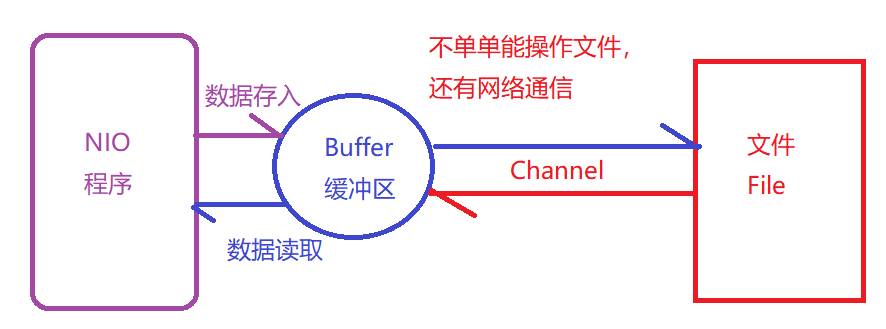
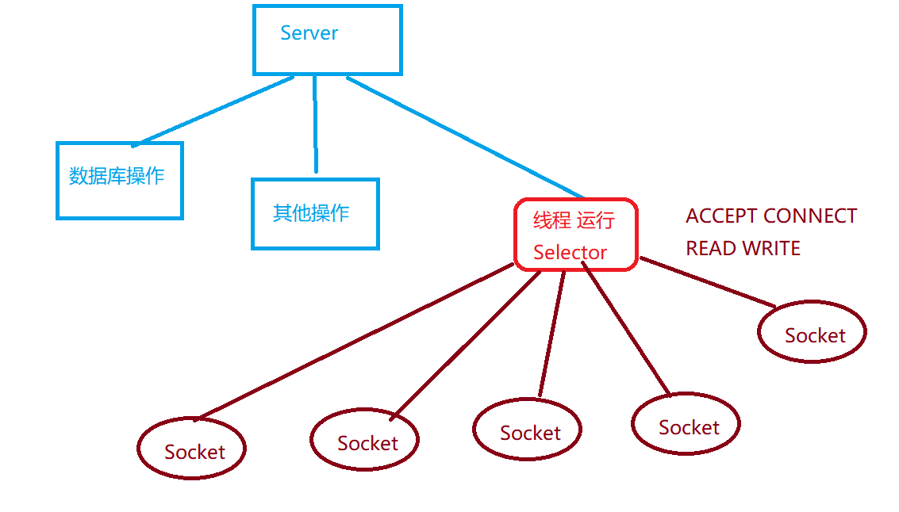

# Day 30

> Author : ScorpioDong

## 1. 单例模式

### 1.1 要求

```
	当前类只有一个对象，一旦当前类存在一个对象之后，无法在重新创建当前类的对象，就算是你要创建，代码返回的对象依然是上一次创建的对象。
	懒汉模式，饿汉模式
```

### 1.2 单例模式推导

```java
package com.qfedu.a_single;

import java.util.concurrent.locks.Lock;
import java.util.concurrent.locks.ReentrantLock;

/**
 * SingleDog要求是一个单例类，整个代码运行周期内有且只有一个类对象
 *
 * 不可取方式:
 * @全体成员 SingleDog类使用一个单例类，我创建过对象了，你们不要搞事情
 *          红包
 * 【期望】
 *      从语法角度约束一些行为。
 *      目前创建对象过于简单，new + 构成方法组合非常easy
 * 【解决方案】
 *      private修饰构造方法
 *
 * 【问题】
 *      构造方法私有化之后，类外没有操作构造方法的权限，没办法创建对象
 * 【解决方案】
 *      1. 暴力反射
 *          暴力反射，给予构造方法操作权限，这里和没有使用private有什么区别
 *          【不合适】
 *      2. 期望
 *          类外最起码有一个对象。
 *          a. 类外没有SingleDog类对象
 *          b. 期望获取到一个SingleDog对象
 *
 *          需要方法来完成
 *              1. 该方法要求静态成员方法，没有对象，需要通过类名调用
 *              2. 类外要求使用public修饰
 *              3. 该方法需要得到一个SingleDog对象，返回值类型是SingleDog
 *              4. 方法参数为无参数，构造方法也是无参
 *              5. 方法名 getInstance
 *              public static SingleDog getInstance()
 *
 * 【问题】
 *      依然是不同对象
 *
 * 【期望】
 *      1. 调用该方法每一次调用都是new新的对象。
 *      2. 这个new得有限制，如果之前创建过对象，你就不能再new了，没有对象可以new
 *      3. 存在一个变量可以保存之前创建对象的空间首地址，并且可以持久性保存。
 *      分析：
 *          a. 需要保存SingleDog类对象空间首地址
 *                 SingleDog类型
 *          b. 该数据不能类外轻松获取
 *                 private
 *          c.
 *              (1) 静态方法可以使用
 *              (2) 有一定的持久性
 *                  static修饰成员变量
 *          private static SingleDog sd = null;
 * 【getInstance方法】
 *      需要判断
 *          判断SingleDog类型的静态成员变量 sd是否保存有之前创建的空间首地址
 *
 * 【问题】
 *      多线程情况下，存在线程抢占问题，极有可能导致当前方法被两个线程同时执行，同时
 *      创建对象
 *      com.qfedu.a_single.SingleDog@22673956
 *      com.qfedu.a_single.SingleDog@6223c513
 *
 * 【期望】
 *      在多线程情况下，也是安全的
 * 【解决方案】
 *      加锁
 *          【墙裂推荐】synchronized同步代码块
 *              使用同步代码块，用什么做锁对象?
 *              最合适的锁对象依然是Single.class
 *
 *          【墙裂推荐】synchronized同步方法
 *              static修饰静态方法的情况下，什么是锁对象?
 *                  当前SingleDog类.class字节码文件
 *                  
 *          【不推荐】Lock锁对象
 *              和以上两个方式对比?
 *              new ==> lock ==> 多出一个Lock锁空间
 *              (1) 在getInstance方法new lock是不合适，多个线程情况下
 *              可能会出现不同锁情况
 *              (2) Lock做成静态成员变量
 *                  浪费空间了！！！
 *
 *
 * @author Anonymous 2020/3/13 10:53
 */
public class SingleDog {
    private static SingleDog sd = null;

    private SingleDog() {}
	
    // 同步方法
    public static synchronized SingleDog getInstance() {
        if (null == sd) {
            sd = new SingleDog();
        }

        return sd;
    }
}

public class SingleDog1 {
    private static SingleDog1 sd = null;

    private SingleDog1() {}

    // 同步代码块
    public static  SingleDog1 getInstance() {
        synchronized (SingleDog1.class) {
        	if (null == sd) {
        	    sd = new SingleDog1();
        	}
    	}
    
        return sd;
    }
}
```

```java
package com.qfedu.a_single;

/**
 * 另一个单例模式
 *
 * @author Anonymous 2020/3/13 11:44
 */
public class SingleCat {
    /*
    static修饰，在代码的加载阶段创建完成
    并且使用final修饰，保存当前指向不可以改变
    private修饰类外无法直接获取，不能修改
     */
    private static final SingleCat sc = new SingleCat();

    private SingleCat() {}

    /*
    使用方法做的统一
     */
    public static SingleCat getInstance() {
        return sc;
    }
}
```

## 2. NIO

### 2.1 BIO概述

```
BIO
	BIO ==> Basic IO (基本IO), Block IO(阻塞IO)
	Scanner操作，文件读写操作，Socket数据传输操作... 都是BIO
	
	比如TPC群聊，私聊聊天室
		Socket涉及到的IO，也是BIO
		资源浪费：
			1. 多线程，每一个Socket会对应一个线程，如果用户量巨大，会导致线程过
			多，资源处理过多
			2. 采用阻塞状态，一旦进入阻塞，代码无法执行其他操作。
			3. 承载量一般，吞吐量比较小，同时可靠性不佳
```

### 2.2 NIO概述

```
NIO
	NIO ==> New IO(新IO), Non-Block IO(非阻塞IO)
	NIO非阻塞IO，运行当前程序在处理IO事务时，不会影响其他程序的运行，可以在不使用多线程的情况下，满足IO操作要求。
	三大核心部分:
		通道
			Channel
			文件操作，网络数据传递操作使用的通道
		缓冲
			Buffer
			缓冲使用可以提供操作效率，减少不必要的读写次数
		选择器
			Selector
			真·核心 老大 boss
```



### 2.3 Buffer Channel完成文件操作

#### 2.3.1 常用API

```
java.nio.Buffer
Buffer缓冲区
	ByteBuffer 字节缓冲 常用
	ShortBuffer
	IntBuffer
	LongBuffer 
	CharBuffer 字节缓冲 常用
	FloatBuffer
	DoubleBuffer

常用方法:
	public static ByteBuffer allocate(int capacity);
		按照指定的字节数分配对应的缓冲区空间，保存字节数据
	public byte get(); 
		从字节缓冲区对象中读取一个byte类型数组
	public final Buffer flip();
		翻转缓冲区，回到缓冲区的开始位置。
	public static ByteBuffer wrap(byte[] arr);
		存入一个byte类型数组到缓冲区，会得到一个新的ByteBuffer
	public static ByteBuffer put(byte[] b);
		将字节数组存入缓冲去
		

Channel接口，通道接口
	FileChannel 文件操作通道
	DatagramChannel UDP协议数据包操作的Channel
	ServerSocketChannel TCP服务端ServerSocket对应Channel
	SocketChannel TCP客户端Socket对应Channel
首先操作文件，以FileChannel为例
	public long read(ByteBuffer buffer);
		从通道中读取数据到ByteBuffer中
	public long write(ByteBuffer buffer);
		从Buffer中写数据到通道中
	public long transferFrom(ReadableByteChannel src, long position, long count) 
	从指定srcChannel中，指定位置position开始，读取count个元素，到当前通道中
	文件复制操作。
	
	public long	transferTo(long position, long count, WritableByteChannel target) 
	将当前通道中的数据写入到target中，从当前通道的position位置开始，计数count
```

#### 2.3.2 操作文件数据

 ```java
package com.qfedu.b_niofile;

import org.junit.Test;

import java.io.*;
import java.nio.ByteBuffer;
import java.nio.channels.FileChannel;

/**
 * @author Anonymous 2020/3/13 15:17
 */
public class FileNioTest {

    /*
    通过NIO写入数据到文件中的操作
     */
    @Test
    public void testNioFileWrite() throws IOException {
        // 1. 文件操作字节输出流
        FileOutputStream fos = new FileOutputStream("D:/aaa/1.txt");

        // 2. 利用文件操作输出字节流对象获取对应的Channel通道
        FileChannel foc = fos.getChannel();

        // 3. 准备一个缓冲区 4KB缓冲区
        ByteBuffer buffer = ByteBuffer.allocate(1024 * 4);

        // 4. 准备数据，放入缓冲区
        String str = "测试NIO";
        buffer.put(str.getBytes());

        // 5. 存在缓冲区数据放入之后，缓冲区指针发生改变，到达存入数据的末尾
        // 如果此时调用写入操作，会从存入缓冲区之后开始保存
        // 让缓冲区指针回到最初的起点,并且操作写入程序，只会保存缓冲区内的有效数据
        buffer.flip();

        // 6. 缓冲区数据写入到通道中
        foc.write(buffer);

        // 7. 关闭资源
        fos.close();
    }

    @Test
    public void testNioFileRead() throws IOException {
        // 1. 文件字节操作输入流
        FileInputStream fis = new FileInputStream("D:/aaa/1.txt");

        // 2. FileChannel
        FileChannel fic = fis.getChannel();

        // 3. 准备缓冲
        ByteBuffer buffer = ByteBuffer.allocate(1024);

        // 4. 从Channel读取数据保存到缓冲区中
        int read = fic.read(buffer);
        System.out.println(read);

        // 5. 展示数据
        // String(byte[] arr, int off, int count)
        System.out.println(new String(buffer.array(), 0, read));

        // 6. 关闭资源
        fis.close();
    }

    // 130
    @Test
    public void testCopyFile() throws IOException {
        long start = System.currentTimeMillis();
        // 1. 安排输出流和输入流
        FileInputStream fis = new FileInputStream("D:/aaa/1.mp4");
        FileOutputStream fos = new FileOutputStream("D:/aaa/2.mp4");

        // 2. 准备两个Channel
        FileChannel srcChannel = fis.getChannel();
        FileChannel dstChannel = fos.getChannel();

        // 3. 拷贝方法
        srcChannel.transferTo(0, srcChannel.size(), dstChannel);
        // dstChannel.transferFrom(srcChannel, 0, srcChannel.size());

        // 4. 关闭资源
        fos.close();
        fis.close();

        long end = System.currentTimeMillis();
        System.out.println("Time:" + (end - start));
    }

    // 300
    @Test
    public void testCopyUseBuffer() throws IOException {
        long start = System.currentTimeMillis();
        BufferedInputStream bis = new BufferedInputStream(new FileInputStream("D:/aaa/1.mp4"));
        BufferedOutputStream bos = new BufferedOutputStream(new FileOutputStream("D:/aaa/3.mp4"));

        int length = -1;
        byte[] buf = new byte[4 * 1024];

        while ((length = bis.read(buf)) != -1) {
            bos.write(buf, 0, length);
        }

        bos.close();
        bis.close();
        long end = System.currentTimeMillis();
        System.out.println("Time:" + (end - start));
    }
}
 ```

### 2.4 网络编程使用NIO【重点】

#### 2.4.1 Selector选择器老大

```
Selector
	选择器，网络编程使用NIO的大哥！！！
	服务器可以执行一个线程，运行Selector程序，进行监听操作。
	新连接， 已经连接， 读取数据，写入数据

Selector常用方法：
	public static Selector Open();
		得到一个选择器对象
	public int select(long timeout);
		监听所有注册通道，存在IO流操作是，会将对应的信息SelectionKey存入到内部的集
		合中，参数是一个超时时间
	public Set<SelectionKey> selectionKeys();
		返回当前Selector内部集合中保存的所有SelectionKey
```



#### 2.4.2 SelectionKey

```
SelectionKey
	表示Selector和网络通道直接的关系
	int OP_ACCEPT; 16 需要连接
	int OP_CONNECT; 8  已经连接
	int OP_READ; 1  读取操作
	int OP_WRITE; 4 写入操作
SelectionKey
	public abstract Selector selector();
		得到与之关联的 Selector 对象
	public abstract SelectableChannel channel();
		得到与之关联的通道
	public final Object attachment();
		得到与之关联的共享数据
	public abstract SelectionKey interestOps(int ops);
		设置或改变监听事件
	public final boolean isAcceptable();
		是否可以 accept
	public final boolean isReadable();
		是否可以读
	public final boolean isWritable();
		是否可以写
```

#### 2.4.3 ServerSocketChannel

```
ServerSocketChannel
	服务端Socket程序对应的Channel通道
常用方法:
	public static ServerSocketChannel open();
		开启服务器ServerSocketChannel通道，等于开始服务器程序
	public final ServerSocketChannel bind(SocketAddress local);
		设置服务器端端口号
	public final SelectableChannel configureBlocking(boolean block);
		设置阻塞或非阻塞模式， 取值 false 表示采用非阻塞模式
	public SocketChannel accept();
		[非阻塞]
			获取一个客户端连接，并且得到对应的操作通道
	public final SelectionKey register(Selector sel, int ops);
		[重点方法]
			注册当前选择器，并且选择监听什么事件
```

#### 2.4.4 SocketChannel

```
SocketChannel
	客户端Socket对应的Channel对象

常用方法:
	public static SocketChannel open();
		打卡一个Socket客户端Channel对象
	public final SelectableChannel configureBlocking(boolean block)
		这里可以设置是阻塞状态，还是非阻塞状态
		false，表示非阻塞
	public boolean connect(SocketAddress remote);
		连接服务器
	public boolean finishConnect();
		如果connect连接失败，可以通过finishConnect继续连接
	public int write(ByteBuffer buf);
		写入数据到缓冲流中
	public int read(ByteBuffer buf);	、
		从缓冲流中读取数据
	public final SelectionKey register(Selector sel, int ops, Object attechment);
		注册当前SocketChannel，选择对应的监听操作，并且可以带有Object attachment参数
	public final void close();
		关闭SocketChannel
```

#### 