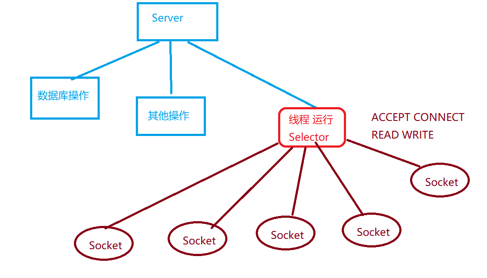

# Day 31

#### 1. NIO完成网络编程

##### 1.1 Selector选择器老大

```
Selector
	选择器，网络编程使用NIO的大哥！！！
	服务器可以执行一个线程，运行Selector程序，进行监听操作。
	新连接， 已经连接， 读取数据，写入数据

Selector常用方法：
	public static Selector Open();
		得到一个选择器对象
	public int select(long timeout);
		监听所有注册通道，存在IO流操作是，会将对应的信息SelectionKey存入到内部的集
		合中，参数是一个超时时间
	public Set<SelectionKey> selectionKeys();
		返回当前Selector内部集合中保存的所有SelectionKey
```



##### 1.2 SelectionKey

```
SelectionKey
	表示Selector和网络通道直接的关系
	int OP_ACCEPT; 16 需要连接
	int OP_CONNECT; 8  已经连接
	int OP_READ; 1  读取操作
	int OP_WRITE; 4 写入操作
SelectionKey
	public abstract Selector selector();
		得到与之关联的 Selector 对象
	public abstract SelectableChannel channel();
		得到与之关联的通道
	public final Object attachment();
		得到与之关联的共享数据
	public abstract SelectionKey interestOps(int ops);
		设置或改变监听事件
	public final boolean isAcceptable();
		是否可以 accept
	public final boolean isReadable();
		是否可以读
	public final boolean isWritable();
		是否可以写
```

##### 1.3 ServerSocketChannel

```
ServerSocketChannel
	服务端Socket程序对应的Channel通道
常用方法:
	public static ServerSocketChannel open();
		开启服务器ServerSocketChannel通道，等于开始服务器程序
	public final ServerSocketChannel bind(SocketAddress local);
		设置服务器端端口号
	public final SelectableChannel configureBlocking(boolean block);
		设置阻塞或非阻塞模式， 取值 false 表示采用非阻塞模式
	public SocketChannel accept();
		[非阻塞]
			获取一个客户端连接，并且得到对应的操作通道
	public final SelectionKey register(Selector sel, int ops);
		[重点方法]
			注册当前选择器，并且选择监听什么事件
```

##### 1.4 SocketChannel

```
SocketChannel
	客户端Socket对应的Channel对象

常用方法:
	public static SocketChannel open();
		打卡一个Socket客户端Channel对象
	public final SelectableChannel configureBlocking(boolean block)
		这里可以设置是阻塞状态，还是非阻塞状态
		false，表示非阻塞
	public boolean connect(SocketAddress remote);
		连接服务器
	public boolean finishConnect();
		如果connect连接失败，可以通过finishConnect继续连接
	public int write(ByteBuffer buf);
		写入数据到缓冲流中
	public int read(ByteBuffer buf);	、
		从缓冲流中读取数据
	public final SelectionKey register(Selector sel, int ops, Object attechment);
		注册当前SocketChannel，选择对应的监听操作，并且可以带有Object attachment参数
	public final void close();
		关闭SocketChannel
```

##### 1.5 使用NIO完成一个客户端和服务器

###### 1.5.1 首先完成客户端

```java
package com.qfedu.a_tcpnio;

import java.io.IOException;
import java.net.InetSocketAddress;
import java.nio.ByteBuffer;
import java.nio.channels.SocketChannel;
import java.util.Scanner;
import java.util.concurrent.ThreadPoolExecutor;

/**
 * 符合TCP协议，非阻塞IO NIO完成对应的客户端代码
 *
 * @author Anonymous 2020/3/16 15:10
 */
public class TcpNioClient {
    public static void main(String[] args) throws IOException, InterruptedException {
        // 1. 得到一个网络通道
        SocketChannel socket = SocketChannel.open();

        // 2. 设置当前NIO采用的方式为非阻塞方式
        socket.configureBlocking(false);

        // 3. 确定服务器IP地址和对应程序端口号，创建一个InetSocketAddress对象
        InetSocketAddress address = new InetSocketAddress("192.168.31.154", 8848);

        // 4. 连接服务器
        if (!socket.connect(address)) {
            // 如果是false，表示连接失败，保持申请连接的状态
            while (!socket.finishConnect()) {
                // 因为采用NIO非阻塞方式，在获取等待连接的状态下，可以去做当前程序的其他操作。
                System.out.println("保持呼叫服务器状态，但是我还能做点别的事情~~~ 等待2s继续申请连接~~~");
                Thread.sleep(2000);
            }
        }

        // 5. 准备一个数据存入到缓冲区
        ByteBuffer buffer = ByteBuffer.wrap("你好，服务器，我在等你...".getBytes());

        // 6. 通过SocketChannel 符合TCP协议Socket要求Channel对象发送
        socket.write(buffer);

        new Scanner(System.in).nextLine();
    }
}
```

###### 1.5.2 再来完成服务端

```
1. 开启服务器 
	ServerScoketChannel
2. 开启Selector 大哥
	Selector对象
3. 服务器ServerSocketChannel bind监听端口号 
	8848端口
4. 设置非阻塞状态
	configureBlocking(false)
5. Selector 注册--> ServerSocketChannel
	register(selector, OP_ACCEPT);

6. Selector大哥开始忙活
	6.1 获取连接，注册对应的Socket
	6.2 监听读写事件
		6.2.1 读数据。客户端发送数据到服务器
		6.2.2 写数据。发送数据数据给客户端
	
```

```java
package com.qfedu.a_tcpnio;

import java.io.IOException;
import java.net.InetSocketAddress;
import java.nio.ByteBuffer;
import java.nio.channels.*;
import java.util.Iterator;
import java.util.Set;

/**
 * 使用ServerSocketChannel NIO非阻塞方式，完成服务端代码
 *
 * 1. 开启服务器
 * 	    ServerScoketChannel
 * 2. 开启Selector 大哥
 * 	    Selector对象
 * 3. 服务器ServerSocketChannel bind监听端口号
 * 	    8848端口
 * 4. 设置非阻塞状态
 * 	    configureBlocking(false)
 * 5. ServerSocketChannel 注册--> Selector
 * 	    register(selector, OP_ACCEPT);
 *
 * 6. Selector大哥开始忙活
 * 	    6.1 获取连接，注册对应的Socket
 * 	    6.2 监听读写事件
 * 		    6.2.1 读数据。客户端发送数据到服务器
 * 		    6.2.2 写数据。发送数据数据给客户端
 *
 *
 * @author Anonymous 2020/3/16 15:44
 */
public class TcpNioServer {
    public static void main(String[] args) throws IOException {
        // 1. 开启服务器
        ServerSocketChannel serverSocket = ServerSocketChannel.open();

        // 2. 开启Selector 大哥
        Selector selector = Selector.open();

        // 3. 服务端代码绑定端口号
        serverSocket.bind(new InetSocketAddress(8848));

        // 4. 设置非阻塞状态
        serverSocket.configureBlocking(false);

        // 5. ServerSocketChannel 注册--> Selector 返回值是一个SelectionKey
        // 并且明确当前Selector监听SelectionKey.OP_ACCEPT，监听连接服务器
        serverSocket.register(selector, SelectionKey.OP_ACCEPT);

        // 6. 大哥干活
        while (true) {
            // 6.1 获取连接，注册对应的Socket
            if (0 == selector.select(1000)) {
                // 0 == selector.select(1000) 表示没有连接到客户端
                System.out.println("ServerSocket提示，当前没有客户端搭理我，我自己默默的画圈圈~~~");
                continue;
            }

            // 6.2 监听读写事件
            // 得到当前Selector中所有的SelectionKey
            Iterator<SelectionKey> selectionKeys = selector.selectedKeys().iterator();
            while (selectionKeys.hasNext()) {

                SelectionKey selectionKey = selectionKeys.next();
                // 6.2.1 判断客户端是一个连接请求 OP_ACCEPT
                if (selectionKey.isAcceptable()) {
                    System.out.println("客户端请求连接!!!");
                    // 获取对应的Socket，只不过这里是获取对应的SocketChannel
                    SocketChannel socket = serverSocket.accept();
                    // 设置当前对应客户端的SocketChannel对象是一个非阻塞状态
                    socket.configureBlocking(false);
                    /*
                     注册当前Socket对象
                     selector 注册到当前的Selector【核心】
                     SelectionKey.OP_READ 选择当前Socket监听的操作内容是OP_READ 从当前Socket中读取数据
                     ByteBuffer.allocate(1024 * 4) attachment 补充参数，这里是给予当前Socket对象一个4KB 字节缓冲区对象
                     */
                    socket.register(selector, SelectionKey.OP_READ, ByteBuffer.allocate(1024 * 4));
                }

                // 6.2.2 判断客户端目前是可读状态，获取客户端发送给服务器的数据
                if (selectionKey.isReadable()) {
                    // 从SelectionKey 中获取对应的SocketChannel对象
                    SocketChannel socket = (SocketChannel) selectionKey.channel();

                    // 因为使用的是NIO，涉及到Channel和ByteBuffer，数据在缓冲区中
                    ByteBuffer buffer = (ByteBuffer) selectionKey.attachment();

                    // 读取数据。利用SocketChannel从缓冲中ByteBuffer中读取数据。
                    socket.read(buffer);

                    System.out.println("客户端发送数据:" + new String(buffer.array()));
                }

                // 处理完进行一个移除当前SelectionKey操作
                selectionKeys.remove();
            }
        }


    }
}
```

#### 2. NIO完成一个TCP聊天室

##### 2.1 NIO TCP聊天室客户端完成

```java
package com.qfedu.b_niochat;

import java.io.IOException;
import java.net.InetSocketAddress;
import java.nio.ByteBuffer;
import java.nio.channels.SocketChannel;

/**
 * NIO 非阻塞状态的TCP聊天室客户端核心代码
 *
 * @author Anonymous 2020/3/16 16:20
 */
public class ChatClient {
    /**
     * 服务器IP地址
     */
    private static final String HOST = "192.168.31.154";

    /**
     * 服务器连接对应的端口号
     */
    private static final int PORT = 8848;

    /**
     * 返回NIO要求是ScoketChannel对象
     */
    private SocketChannel socket;

    /**
     * 用户名
     */
    private String userName;

    /**
     * 客户端构造方法，创建客户端对象
     *
     * @param userName 指定的用户名
     */
    public ChatClient(String userName) throws IOException, InterruptedException {
        // 1. 打开SocketChannel
        socket = SocketChannel.open();

        // 2. 设置非阻塞状态
        socket.configureBlocking(false);

        // 3. 根据指定的HOST IP地址和对应PORT端口号创建对应的 InetSocketAddress
        InetSocketAddress address = new InetSocketAddress(HOST, PORT);

        // 4. 连接服务器
        if (!socket.connect(address)) {
            // 如果没有连接到服务器，保持请求连接的状态
            while (!socket.finishConnect()) {
                System.out.println("服务器请求连接失败，等待2s继续请求连接...");
                Thread.sleep(2000);
            }
        }

        this.userName = userName;

        System.out.println("客户端 " + userName + " 准备就绪");
    }

    /*
    这里需要完成两个方法，一个是发送数据到服务器，一个是接受服务器发送的数据
     */

    /**
     * 发送数据到服务器，用于广播消息，群聊
     *
     * @param message 指定的消息
     */
    public void sendMsg(String message) throws IOException {
        // 断开服务器连接 close
        if ("close".equals(message)) {
            socket.close();
            return;
        }
        /*
        StringBuffer
            线程安全，效率低
        StringBuilder
            线程不安全，效率高
         */
        message = userName + ":" + message;
        ByteBuffer buffer = ByteBuffer.wrap(message.getBytes());
        socket.write(buffer);
    }

    public void receiveMsg() throws IOException {
        // 准备ByteBuffer
        ByteBuffer buffer = ByteBuffer.allocate(1024);

        int length = socket.read(buffer);
        if (length > 0) {
            System.out.println(new String(buffer.array()));
        }
    }
}
```

##### 2.2 NIO TCP聊天室服务端完成

```java
package com.qfedu.b_niochat;

import java.io.IOException;
import java.net.InetSocketAddress;
import java.nio.ByteBuffer;
import java.nio.channels.*;
import java.util.Iterator;
import java.util.Set;

/**
 * NIO 非阻塞状态的TCP聊天室服务端核心代码
 *
 * @author Anonymous 2020/3/16 16:59
 */
public class ChatServer {

    /**
     * 服务器核心模块，ServerSocketChannel
     */
    private ServerSocketChannel serverSocket;

    /**
     * 服务端NIO Selector选择器
     */
    private Selector selector;

    /**
     * 服务端监听服务指定端口号
     */
    private static final int PORT = 8848;

    /*
    1. 构造方法
    2. 接收方法
    3. 发送方法(广播)
    4. 同时启动接收和发送功能 start
     */

    /**
     * 服务器构造方法，开启ServerSocketChannel，同时开启Selector，注册操作
     *
     * @throws IOException 异常
     */
    public ChatServer() throws IOException {
        // 1. 启动服务器SocketServer NIO服务器
        serverSocket = ServerSocketChannel.open();

        // 2. 启动选择器
        selector = Selector.open();

        // 3. 端口绑定
        serverSocket.bind(new InetSocketAddress(PORT));

        // 4. 选择NIO方式为非阻塞状态
        serverSocket.configureBlocking(false);

        // 5. 注册SeverSocket，确定当前监听的状态是OP_ACCEPT
        serverSocket.register(selector, SelectionKey.OP_ACCEPT);
    }

    /**
     * 服务器干活方法，指定客户端绑定，数据接收和转发
     */
    public void start(){
        try {
            while (true) {
                if (0 == selector.select(2000)) {
                    System.out.println("服务器默默的等待连接，无人访问...");
                    continue;
                }

                /*
                selectedKeys：
                    获取当前所有发生事件操作的对应SelectionKey Set集合
                 */
                Iterator<SelectionKey> iterator = selector.selectedKeys().iterator();

                while (iterator.hasNext()) {
                    SelectionKey key = iterator.next();
                    // 1. 连接
                    if (key.isAcceptable()) {
                        // 连接客户端，获取对应的SocketChannel对象
                        SocketChannel socket = serverSocket.accept();
                        socket.configureBlocking(false);
                        socket.register(selector, SelectionKey.OP_READ);

                        // 广播上线
                        broadcast(socket, socket.getRemoteAddress().toString() + "上线了");
                    }

                    // 2. 接收数据转发
                    if (key.isReadable()) {
                        readMsg(key);
                    }

                    iterator.remove();
                }
            }
        } catch (IOException e) {
            e.printStackTrace();
        }
    }

    /**
     * 从指定的SelectionKey中读取数据
     *
     * @param key 符合OP_READ 要求的SelectionKey
     */
    public void readMsg(SelectionKey key) throws IOException {
        // 根据指定SelectionKey获取对应的SocketChannel对象
        SocketChannel socket = (SocketChannel) key.channel();

        // 创建缓冲区
        ByteBuffer buffer = ByteBuffer.allocate(1024);
        // 从缓冲区中读取数据，返回值类型是读取到的字节数
        int length = socket.read(buffer);

        // 因为读取的数据可能存在0的情况
        if (length > 0) {
            String message = new String(buffer.array());

            // 广播数据
            broadcast(socket, message);
        }
    }

    /**
     * 广播方法，该方法是群发消息，但是不要发给自己
     *
     * @param self 当前发送数据的客户端
     * @param message 消息
     */
    public void broadcast(SocketChannel self, String message) throws IOException {
        /*
         获取当前Selector选择器中所有的SelectionKey
         Selector中注册的内容有SocketChannel对应的SelectionKey
         已经ServerSocketChannel对应的SelectionKey
        */
        Set<SelectionKey> keys = selector.keys();

        // 遍历整个SelectionKey Set集合
        for (SelectionKey key : keys) {
            // 获取对应SelectionKey的Channel对象
            SelectableChannel channel = key.channel();

            // 第一: channel对应的是一个SocketChannel对象，并且不是当前发送消息的SocketChannel对象
            if (channel instanceof SocketChannel && !channel.equals(self)) {
                SocketChannel socketChannel = (SocketChannel) channel;
                // 根据指定的Byte类型数组，创建对应的ByteBuffer缓冲区
                ByteBuffer buffer = ByteBuffer.wrap(message.getBytes());

                // 发送数据
                socketChannel.write(buffer);
            }
        }
    }

    public static void main(String[] args) throws IOException {
        new ChatServer().start();
    }

}
```

##### 2.3 NIO TCP聊天室客户端线程代码实现

```java
package com.qfedu.b_niochat;

import java.io.IOException;
import java.util.Scanner;

/**
 * 客户端线程代码
 *
 * @author Anonymous 2020/3/16 17:37
 */
public class ChatClientThread {
    public static void main(String[] args) throws IOException, InterruptedException {
        Scanner scanner = new Scanner(System.in);

        System.out.println("请输入用户名:");
        String userName = scanner.nextLine();

        if (0 == userName.length()) {
            return;
        }

        ChatClient chatClient = new ChatClient(userName);

        // 接收消息
        new Thread(() -> {
            while (true) {
                try {
                    chatClient.receiveMsg();
                    Thread.sleep(2000);
                } catch (IOException | InterruptedException e) {
                    e.printStackTrace();
                }
            }
        }).start();

        // 发送消息
        while (scanner.hasNextLine()) {
            String msg = scanner.nextLine();

            chatClient.sendMsg(msg);
        }
    }
}

```

#### 

